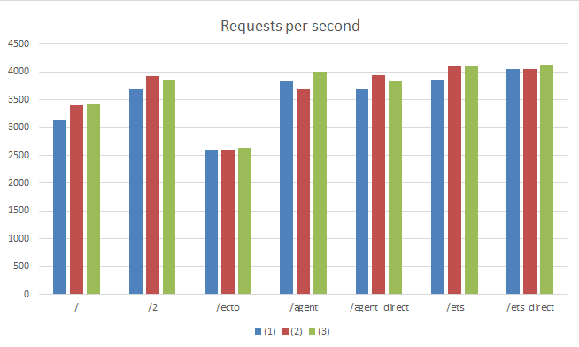

# phoenix-bench-caching
Ecto/Agent/ETSの速度差比較

## 前準備

- Phoenix のプロジェクトを作成
  - `mix phoenix.new bench --no-brunch --database mysql`

- MySQLで下記テーブルを作成
  - テーブル名：phoenix_bench
  - userid: testuser
  - password: passwd

- config/dev.exs に DB の設定、ポートは5000に変更
- `mix ecto.create`
- 動作確認
  - `mix phoenix.server`

- model とテストの準備
  - `mix phoenix.gen.model Cache cache code:integer str:string`
  - `vi priv/repo/migrations/20160728052304_create_cache.exs`
  - `mix ecto.migrate`
  - `vi priv/repo/seeds.exs`
  - `mix run priv/repo/seeds.exs`

## ベンチ環境
- [さくらのVPSの4GB](http://vps.sakura.ad.jp/specification/)
  - CPU: 4core
  - MEM: 4GB

## ベンチする内容

Agent/ETS には、起動時に Ecto からデータを読み込んでセットする

- /: 素のトップページ
- /ecto: Ectoからデータを読み込んで、テンプレートにセット
- /agent: プロセス経由でAgentにあるデータを読み込んで、テンプレートにセット
  - /agent_direct: Agentに直接アクセスして、テンプレートにセット
- /ets: プロセス経由でETSにあるデータを読み込んで、テンプレートにセット
  - /etc_direct: ETSに直接アクセスして、テンプレートにセット


## ベンチ方法
ab でいいや。ab を3回実行して、Requests per second の値で比較する。
念のため、各ベンチの前に `mix phoenix.server` しなおす

```bash
$ ab -n80000 -c800 http://localhost:5000/
```

URL | #/sec(1) | (2) | (3)
--- | --- | --- | ---
/ | 3153.42 | 3400.96 | 3409.81
/ecto | 2607.50 | 2594.72 | 2633.77
/agent | 3833.67 | 3680.11 | 4012.07
/agent_direct | 3705.44 | 3945.81 | 3843.66
/ets | 3862.86 | 4111.47 | 4094.57
/ets_direct | 4055.21 | 4060.01 | 4132.59


### 追試

/ の数値が悪いのは、 index/2 で String.duplicate/2 の文字列生成に時間がかかってるから。コンパイル時に文字列生成するようにした所、数値が改善した。


URL | #/sec(1) | (2) | (3)
--- | --- | --- | ---
/2 | 3705.13 | 3929.37 | 3866.74

## グラフ


## まとめ
特定の処理を単一プロセスだけで行うようなロジックだと、アクセス集中時にそのプロセスがつまって全体のパフォーマンスが落ちる(= /*_direct の方が速い)だろうと予想していたけど、単純なデータ授受ぐらいだと文字列生成の方がよっぽど重いというのは想定外だった。

[Agent/ETS に突っ込むデータが 64 バイトよりも大きいので、Shared Heap に入っている](https://hamidreza-s.github.io/erlang%20garbage%20collection%20memory%20layout%20soft%20realtime/2015/08/24/erlang-garbage-collection-details-and-why-it-matters.html)というのも影響しているだろうけど。

agent の実態は単なる GenServer なので、結果は予想通り。ets は複数プロセスからの同時アクセスに最適化されているような記述がどこかにあったけど、数字を見る限り大きく差があるわけでも無さそう。
